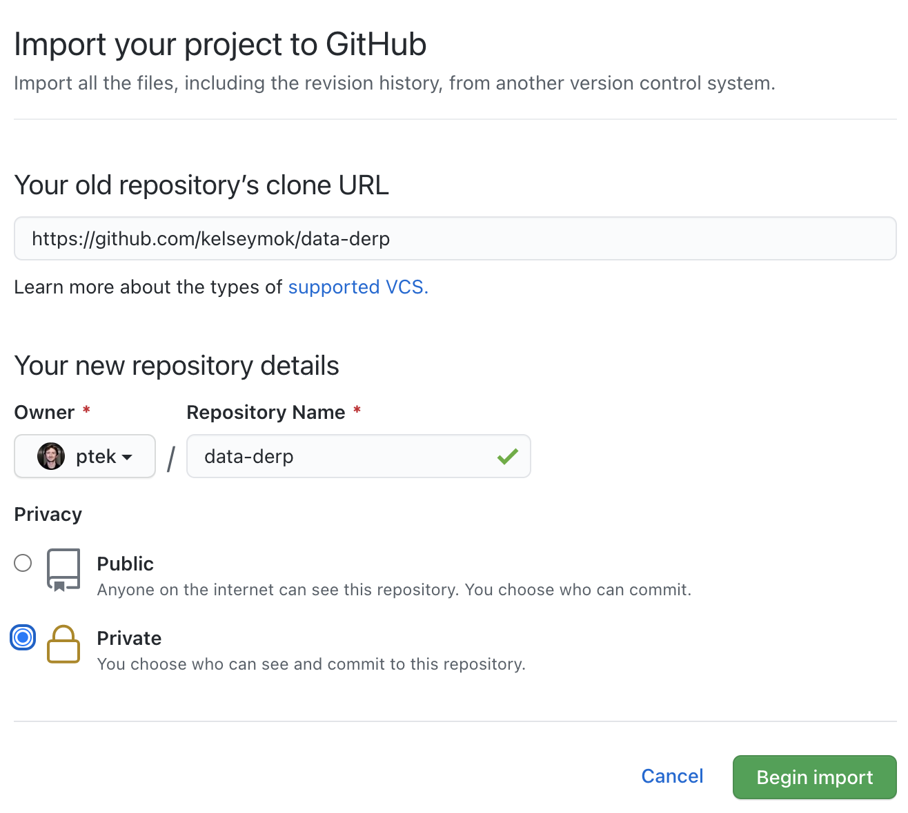

# Data Derp
This repository contains the practical exercise of the Data Derp training. It contains the following relevant modules:
* base
   * .tf files for the creation of an AWS S3 bucket where ingested/transformed files will live
* data-ingestion
   * /src - source code
   * /tests - tests
   * .tf files for the creation of the AWS Glue job 
* data-transformation
   * /src - source code
   * /tests - tests
   * .tf files for the creation of the AWS Glue job
* data-analytics
   * An empty Jupyter Notebook
* data-streaming
   * .dbc files for practice with streaming
* bootstrap
   * Cloudformation template that creates a VPC, Githubrunner (requires a Github Personal Access Token), Terraform Remote State S3 bucket

## Quickstart
1. [Mirror this repo](#mirror-the-repository) in your account as a **PRIVATE** repo (since you're running your own self-hosted GithubRunners, you'll want to ensure your project is Private)
2. Set up your [Development Environment](./development-environment.md)
3. [Bootstrap the AWS Dependencies](./bootstrap/README.md): `./data-derp aws-deps -p <project-name> -m <module-name> -u <github-username>`
   * :bulb: you will need valid AWS credentials. See the [README](./bootstrap/README.md).
   * the `project-name` and `module-name` must be globally unique as an AWS S3 bucket is created (this resource is globally unique) 
4. Create a Github workflow: `./data-derp setup-workflow -p <project-name> -m <module-name>`
   * The `project-name` and `module-name` must be the same as step (3)
5. Fix the tests in `data-ingestion/` and `data-transformation` (in that order). See [Development Environment](./development-environment.md) for tips and tricks on running python/tests in the dev-container.

## Mirror the Repository
1. Start importing a repository in your Github account:  


2. Import the `https://github.com/kelseymok/data-derp` as a **PRIVATE** repo called `data-derp`: 


3. Clone the new repo locally and add the original repository as a source:
```bash
git clone git@github.com:<your-username>/data-derp.git
cd ./data-derp
git remote add source git@github.com:kelseymok/data-derp.git
```

4. To pull in new changes:
```bash
git fetch source
git rebase source/master
```